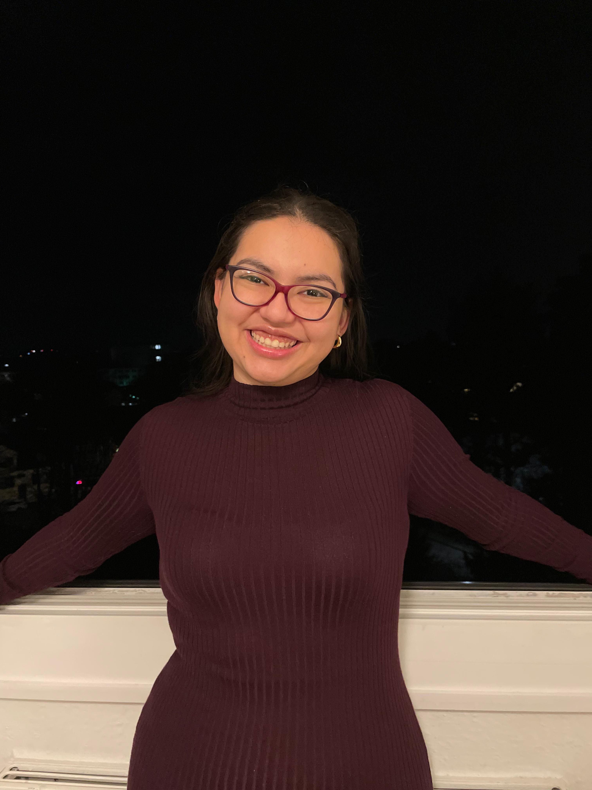

## ¡Hola! Hello! Hallo!

My name is Fátima Mendoza and I'm from El Salvador, if you don't know where it is don't worry most people don't, but I'll tell you know 😉 El Salvador is a smmall country in Central America, it might be small but it's my home. I now live in Germany and I'm studying Environment and Energy B.Sc.
I'm 21 years old, almost 22. I feel a little bit old but I still dream like a kid. 

## My hobbies

I like doing a lot of things, I enjoy drawing and painting. Back in El Salvador I used to teach drawing and painting to kids between 2 and 12 years old. I really love teaching, I thinks of it as an art, you teach but you also learn something every day, it gives you a new perspective of things. 
I also play the violin, I'm a begginer and I'm still learning but I like it. In my free time I like to watch movies and tv shows, I used to watch a lot of movies with my dad and we really enjoyed spending time with each other. Now im far away but we still talk about or favorite shows and recommend each other movies. Our favorites are Christmas movies 🎄

