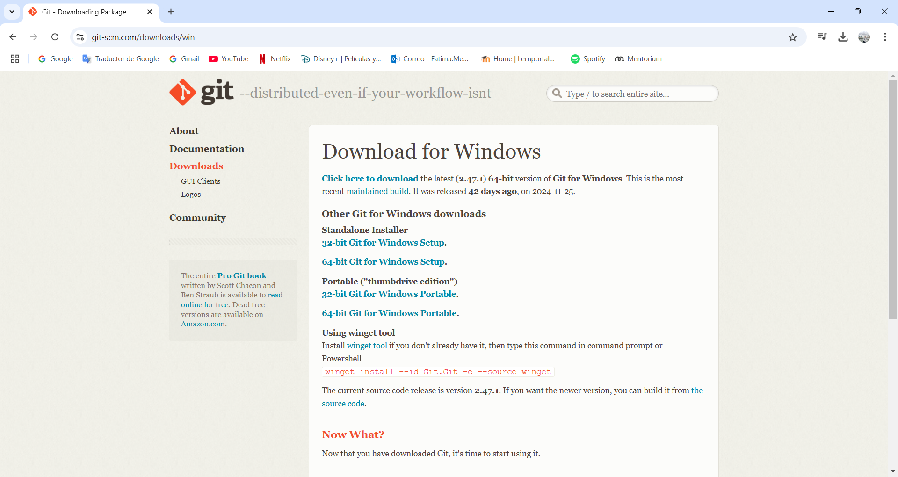

## Git tutorial

First I had to check if is it installed already? 
So I checked it in the terminal as shown in the following image.


So it wasn't installed yet so I download it from the internet.



After I checked it again in the terminal. 


I installed [Visual Studio Code](https://code.visualstudio.com/download) from the internet. Then I initialized git repository in my folder with the following command:

```
git init 
```
After I created a repository in GitHub named FabAcademy2025


It didn't work at the beginning


So fixed it with the following in the terminal

```
git config --global user.name "Fátima Mendoza"
git config --global user.email fatimaliliana.mendoza2003@gmail.com
```

## Changing Static Site Generator

Going from Mkdocs to Astro 🚀

- install [Node.js](https://nodejs.org/es)

open `cmd`, and get the template [CelestialDocs](https://astro.build/themes/details/celestialdocs/) using [astro documentation](https://docs.astro.build/en/install-and-setup/#use-a-theme-or-starter-template), run:
```
npm create astro@latest -- --template HYP3R00T/CelestialDocs
```

in case the installation of dependencies fails just run:
```
npm install
```

to preview the website:
```
npm run dev
```

## My final project

A tethered drone system

As part of the [Emergency Drone Project](https://wiki.eolab.de/doku.php?id=eolab:emergency_drone:start) at Hochschule Rhein Waal, they have athens drones who needs a tethered system to be able to provide a constant and secure source of power. 
The current system is a cable that needs to be unroll manually and connected to a power supply and after using it, it needs to be roll again manually, but this is not efficient to use in a long term. 

With this project I'm aiming to make a tethered system efficient and secure to use. After some time feeling overwhelmed and stuck, I finally find a way to start working on this. I made a list with possible elements of the tethered box, a person of the team check it and told me it was a good start. 
There are elements that are necessary like:
- Input power socket
- Main switch to turn on and off the whole system
  - With a LED that indicates if the system is on or off
- Emergency button
- Switch to enable output power
  - with a LED that indicates if the output is enable or not
- Potentiometer for winding and unwinding the cable
- Display for showing power consumption and other parameters as required

Some possible elements are:
- Ventilation system
- Crank for manual winding and unwinding
- alarm/buzzer for audible notifications in case something is wrong
- Buttons to control de display

Knowing this elements I continue to do an sketch showing how the elements can be positioned. The sketch I made it with [Obsidian](https://obsidian.md/) using a plugin call [Excalidraw](https://excalidraw.com/) and it turn out like this: 


With this clear I was able to make a block diagram to have a better perspective of how this elements can be connected to each other. This is only to start, this diagram needs to be improved. 


