For this week the assignment is:
Model (raster, vector, 2D, 3D, render, animate, simulate, ...) a possible final project, compress your images and videos, and post a description with your design files on your class page

## 3D Design

For this week I had some trouble figuring out what to do, but I ask for some advice and I started with some basic exercises.
Since I have some experience with Fusion 360 I decided to explore some advanced tools to be more efficient when designing.

I started with opening Fusion 360, and creating a new project. Then I created a New Component, using the tool Create -> New Component

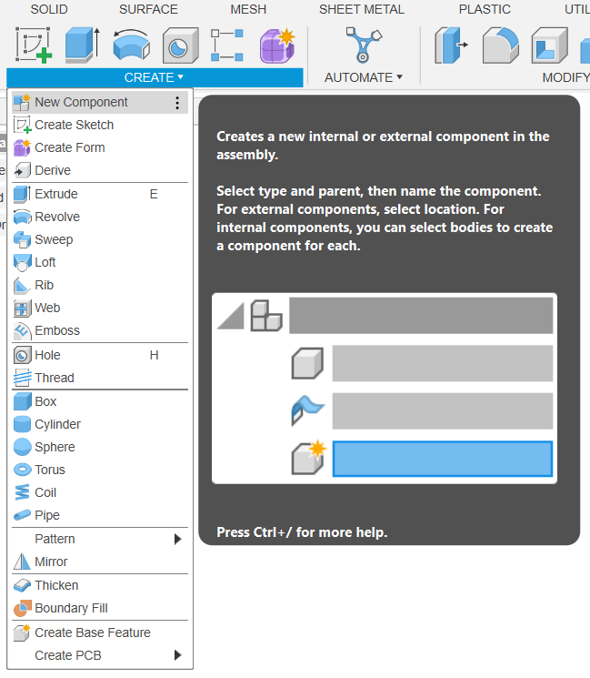

Once you click it, this new window opens and I named it, it's recommended to use a describing name so it's easier to identified, and you clicked OK

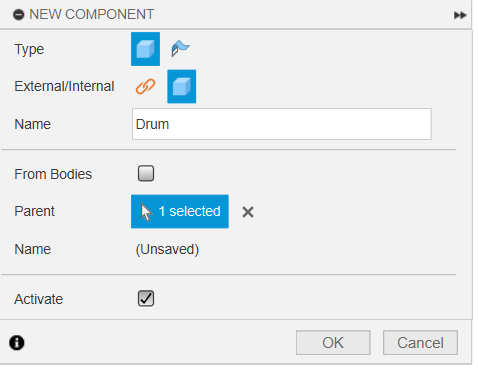

After you created the component you can see it in the BROWSER. Make sure to be working in the component you want, just click the circle on the side of the name.

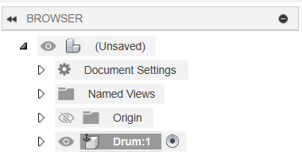

Then I open Change Parameters, it's in the tool Modify.

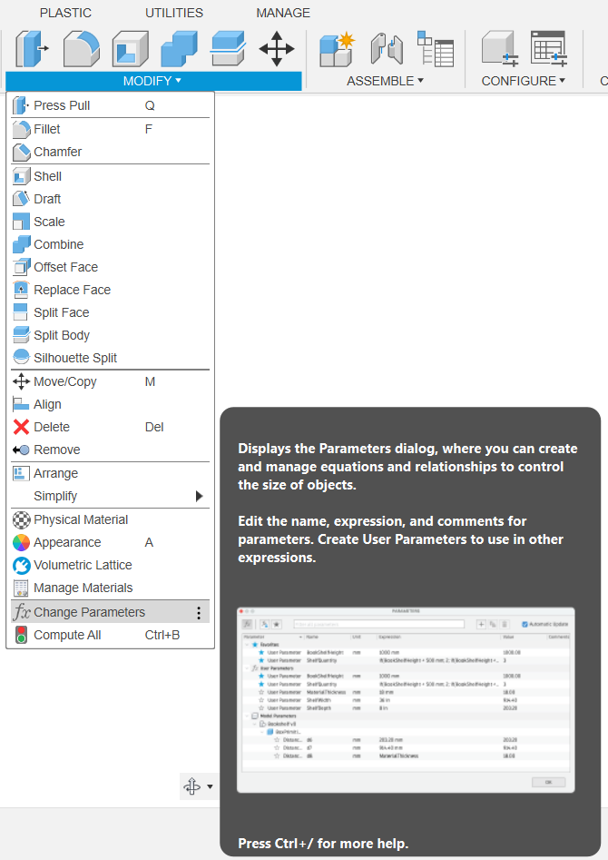

Once you clicked it, this window opens. 
1. You clicked the plus simbol to add new parameters.
2. The the second window opens, in there you give the parameter a name and a value. (Make sure to use a describing name so it easier to use it in the future). Once you have it, you clicked OK.

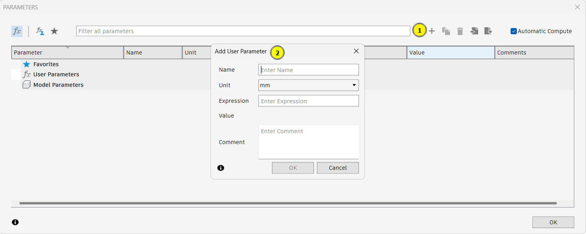

After adding all the parameters that you'll need you can see them in a list. If you make a mistake or you want to change a expression or the name of a parameter you can do it by double clicking the value.

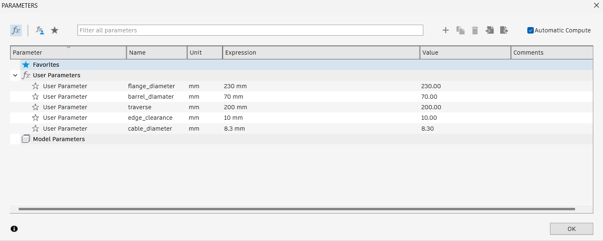

After having all the parameters and the component ready, I created a new sketch, I selected the plane y,z to work. I clicked and then the sketches tool appear and you have your plane to work in it.

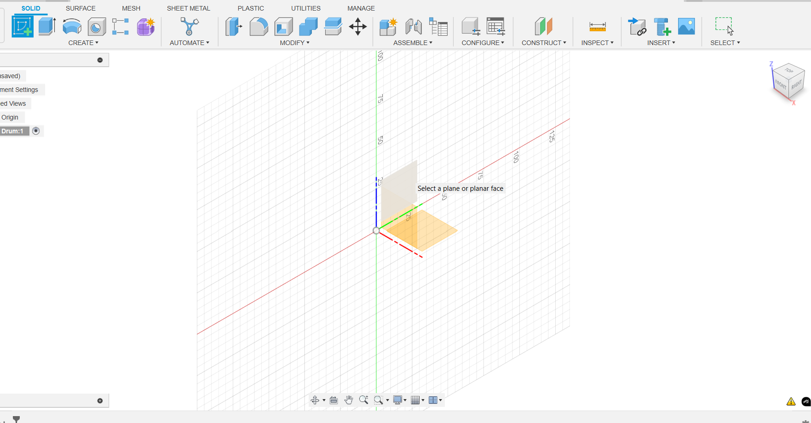

Using the tool Center Diameter Circle I created a new circle, for the measure I used the parameters I stablish before, and that is why it is important to give them a good name, so it's easier when designing. 

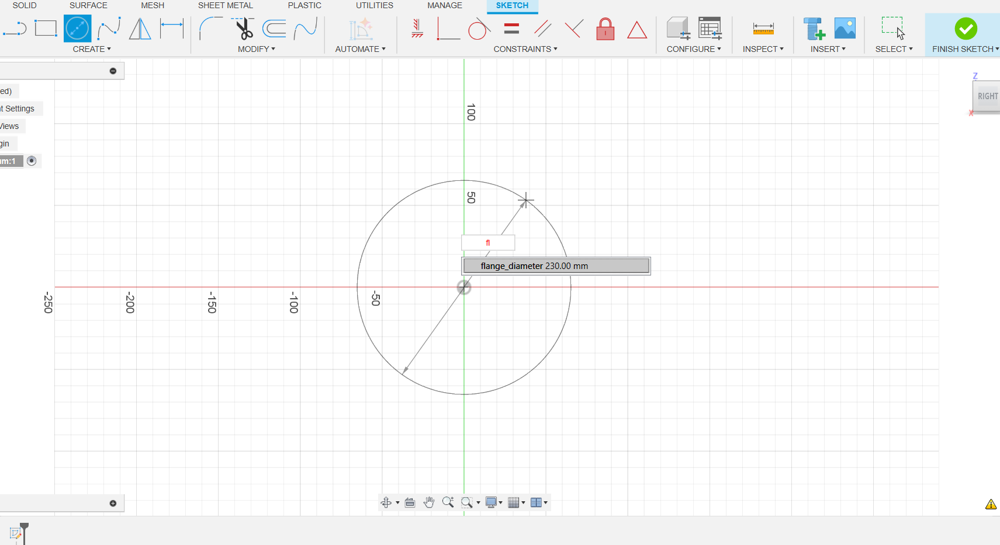

Once you clicked enter you can see your circle has the size you stablish before for the parameter you use. 

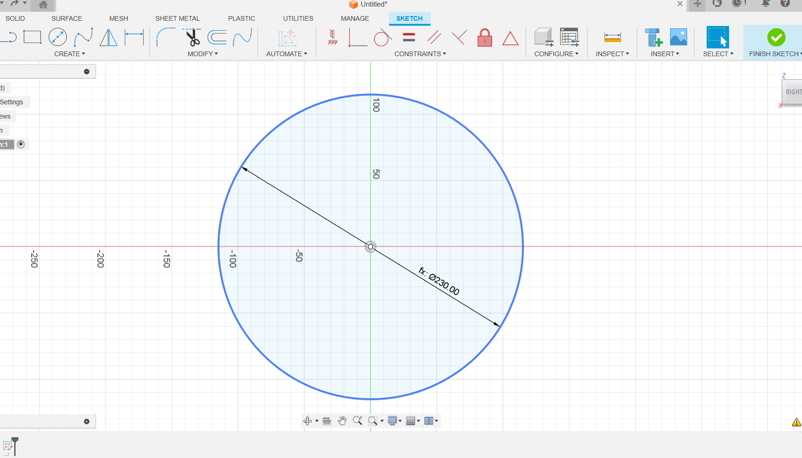

I repeated the process with a second circle.

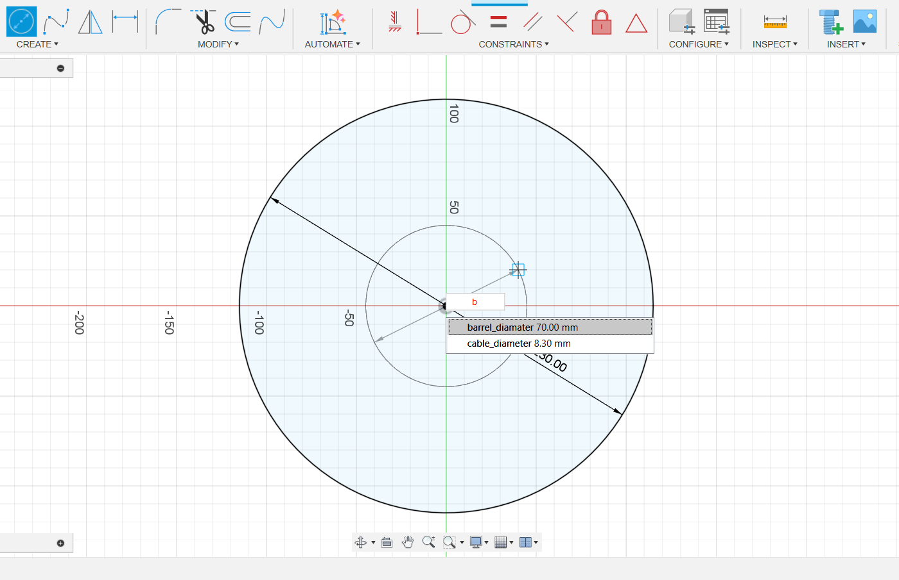

And now I have the two circles I will need to make my drum. So I clicked Finish Sketch.

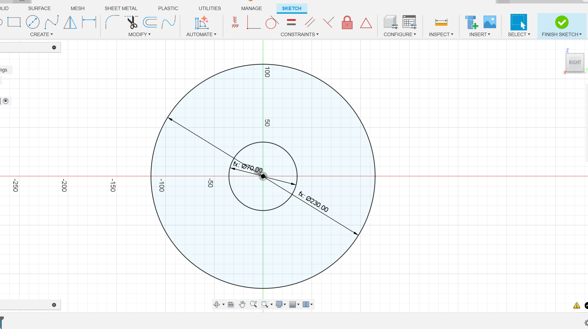

Once the new tools appear I followed the next steps:
1. Clicked the Extrude tool
2. Selected the profile you want to extrude
3. For the direction I selected Symmetric 
4. For Measurement I selected the option Whole length
5. For the Distance I used one of the parameters I stablish before
6. Then I clicked Ok and it's all set

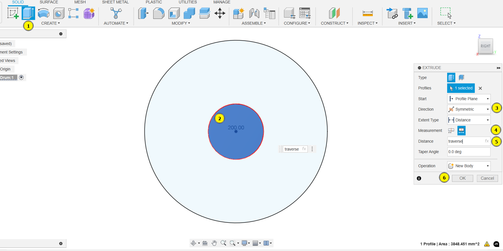

Then I started this process again:
1. I started by displaying the sketch so I'm to select them after
2. I selected the tool Extrude
3. I clicked the Profile to select the profiles
4. I selected the first profile
5. I selected the second profile by clicking while pressing Ctrl
6. For the Start I use the option Object
7. Then I selected the object where I wanted the extrusion to start, which is the end of the tube I made before
8. For the Distance I put the value, I didn't use the parameters because I want to try different ways of designing
9. And then I clicked OK

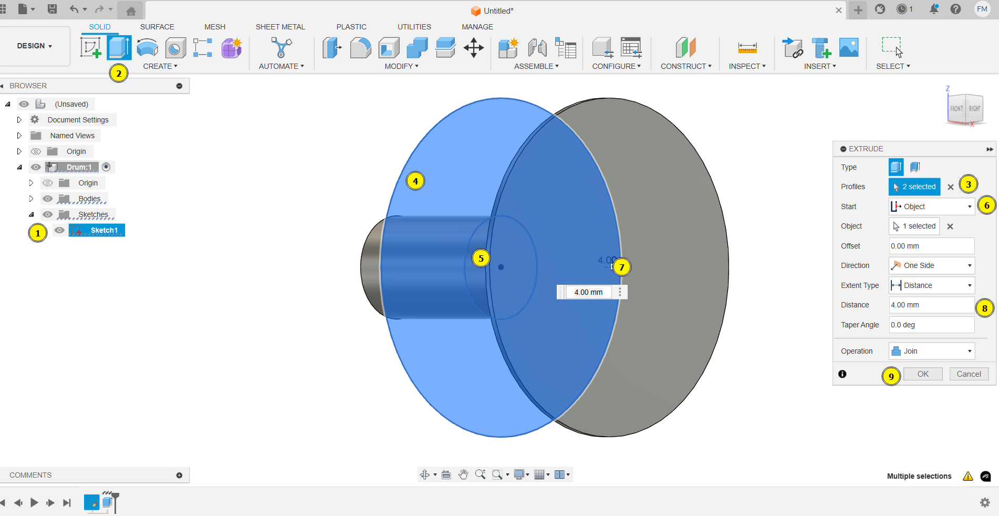

Then once the two extrusions are ready, I selected the tool Mirror

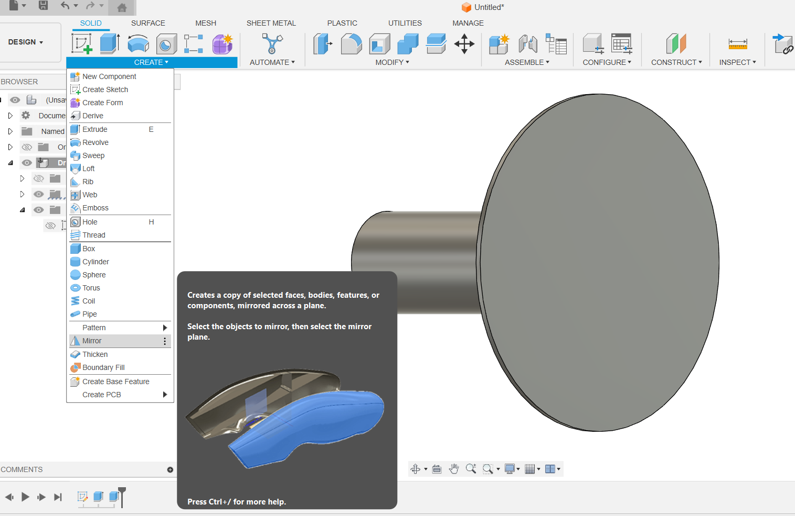

Once you selected a new window opens on the side, and I follow the next steps:
1. The Object type I want to mirror is a Feature
2. For the Object I clicked it
3. And I selected the Feature I just did before for extruding one of the plates of the drums
4. For the Mirror Plane I clicked it 
5. And I selected the plane y,z which is in the middle of my component
6. For the Compute Type I used Optimized
7. And Finally I clicked OK

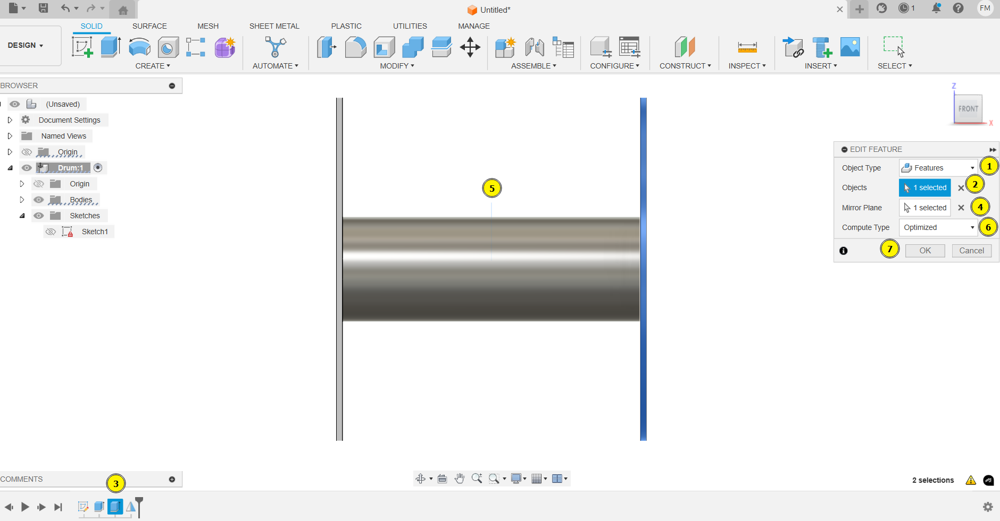

And, done. I finished the drum using new tools which are going to be useful in further designs. To finalize I save it.

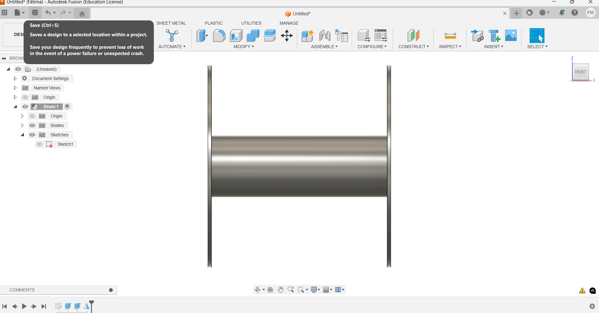

This new window open and you can put the name you want, I named it Drum so it's easy to identify after.

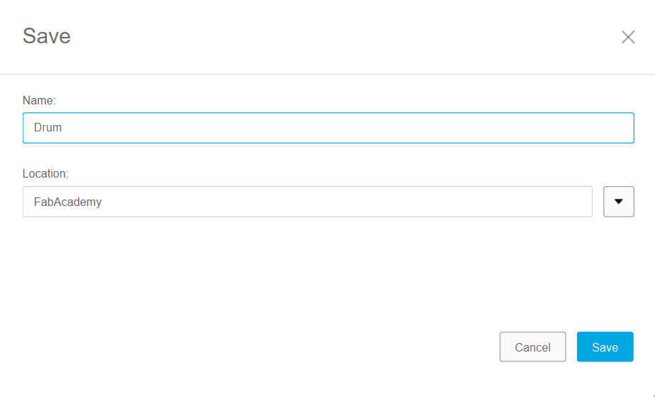

This design was a good exercise to refresh my memory, it was a little difficult at the beginning but I like it and I learn a lot. 