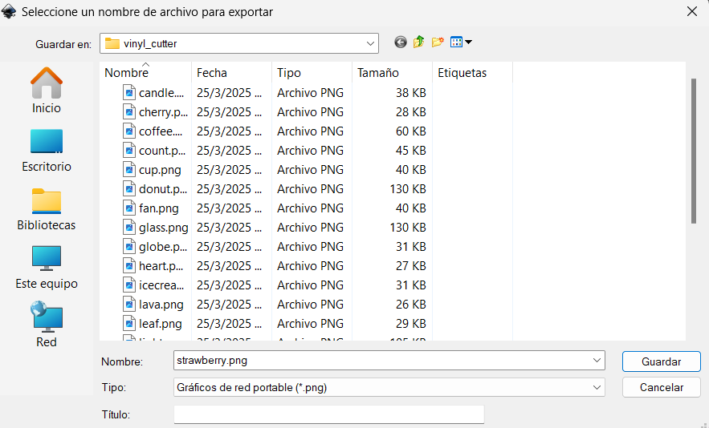
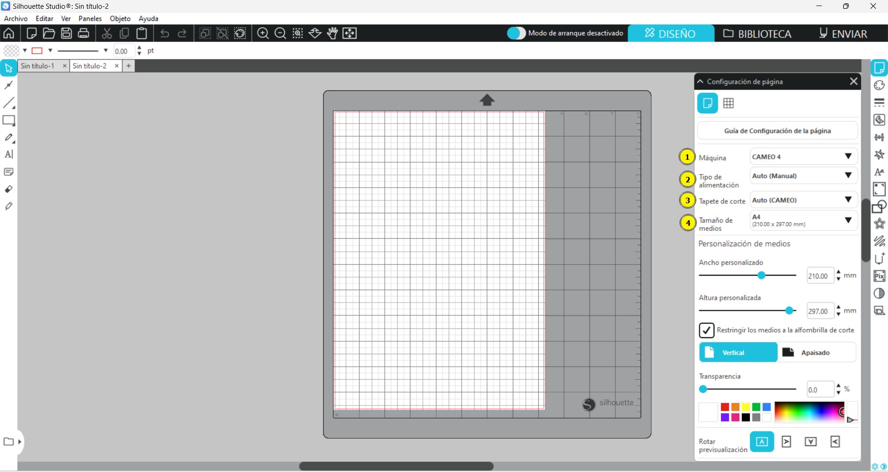
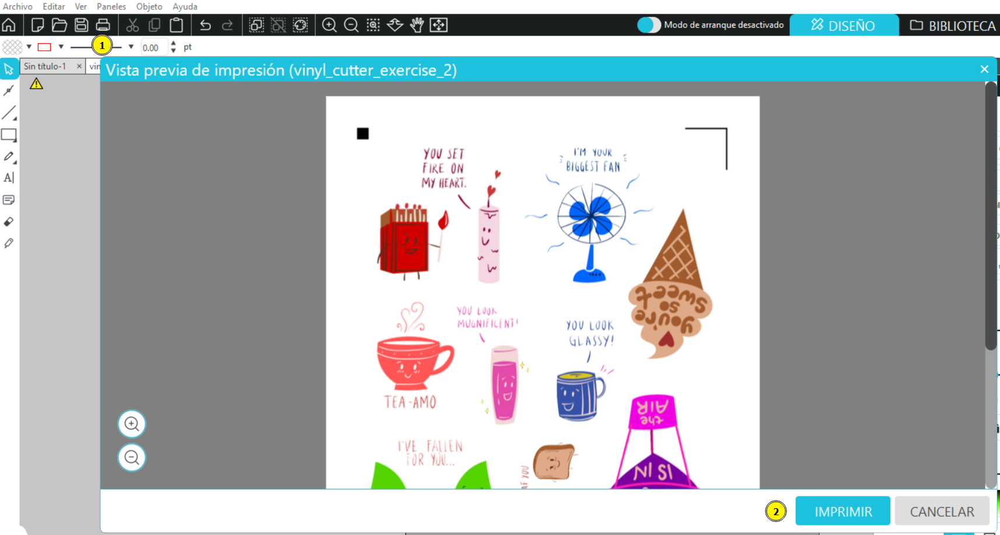
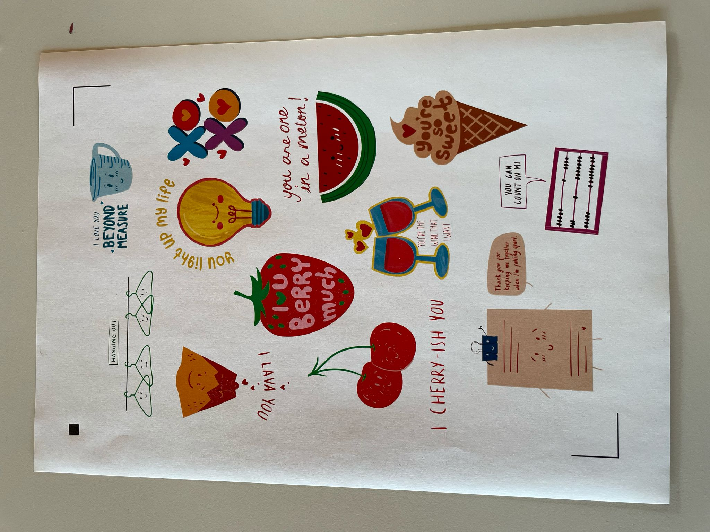

For this week the assignment is:
- Design, lasercut, and document a parametric construction kit, accounting for the lasercutter kerf, which can be assembled in multiple ways.
- Cut something on the vinyl cutter.

## Vinyl Cutter

For this week I was excited for the vinyl cutter exercise. I decided to cut some stickers since I have sticker paper and I really like stickers. 

I was right to be excited because they turn out so beautiful. Let me show you 

First I started looking for inspiration, I used [Canva](https://www.canva.com/) because they have images that I like and it's free, I selected the ones that I liked and the download it as a PDF. I did this because if I download it as .png they have the white background and I didn't want that. 

Once I download it, I open [Inkscape](https://inkscape.org/), which I already had it download it but you can download it [here](https://inkscape.org/release/inkscape-1.4/windows/64-bit/msi/?redirected=1). Once it open I click the button "Cargar" (now you will learn Spanish with my documentatio 😂) to open the PDF I downloaded before. 

I selected the document and clicked "Abrir" to open the PDF.

And now I have my stickers, and they are svg so I was able to change the colors and erase the background. 

I use the layers to select each part of the image and I change the colors to the ones I like the most. For the colors you have some options below but you can also select more color with the color tool on the side.

Here is how my sticker turn out, and you can check in the preview that the image doesn't have a background. Once the sticker is how you want it then you can export it.

You can select where you want it and you name it, then you save it. 

Once I had all the stickers as .png I open [Silhoutte](https://www.silhouetteamerica.com/), which I already had download it. You can download it [here](https://www.silhouetteamerica.com/silhouette-studio?srsltid=AfmBOorW7EzhUzA-Px_khs8qIpe_ZhGWpYqfkaz6T0KpNpzsLsZVMeRp). Then I created a new project.

Then you have the workspace, make sure the parameters match your requirements. 
1. The Machine we have is the CAMEO 4
2. The Feed Type is Auto(Manual)
3. The Cutting Matt is Auto(CAMEO)
4. The Media Size is A4
Make sure to have all this parameters according to your needs, otherwise it won't work correctly.

Then I did the following to make my job easier:
1. I clicked on the icon to open the Print and Cut window
2. And I enable the Register Marks, so I know where the machine won't cut. 

Then in File I use the option Combine so I can add many images in the same page. 

Then I selected the image that I want, and clicked OK. And I repeated the same process over and over until I had all the images I needed.

Once you have the images in the page you can change the size and the position to adjust them the way it suits you better.

Then I used the tool Offset to get and outline of the stickers so they can have a white border. 

Once you have selected the image you click offset and you can change the distance, for most of my stickers I used an offset of 4mm but you can change it.

Then I adjust again the images so they won't collide against each other, you can change the size and rotate them so they can fit better. 

Once you have them all set you can save it by clicking File -> Save as...

Then you select the Folder where you want to save it and:
1. You name the file
2. Select the type, I left the .studio3 type so I can change it later if I need to
3. And click OK to save it

Then to print it you clicked the Print button and this window open and you clicked Print

It looks like this while is loading, in my case I did this to get the PDF to then put it in the USB and print it.

Then we are ready to continue with the process. 
Once we are ready to cut we need to make a few adjustments in Silhoutte. If we leave the document as it is, the machine would cut every single line, if you zoom you can see the red line that indicates the cut. So we will erase the image and just leave the outside red line, as shown as follow. 

It should look like this, we need to make sure to check the configuration of the page so the machine can cut appropriately

Once we click Send this window open and we can make the appropriate adjustments, mine was like this and it worked perfectly 

I printed in my paper stickers and they turn out like this

Then I placed it in the - and I made sure that it was secure and in the correct place

Then I placed it in the machine, it has a line that indicates that it needs to be there and the you clicked the arrow in the machine to introduce the paper

The machine make its work and cuts where we told it to do it, then we take them out of the - and boila we have our stickers ready to place them wherever we like. 

